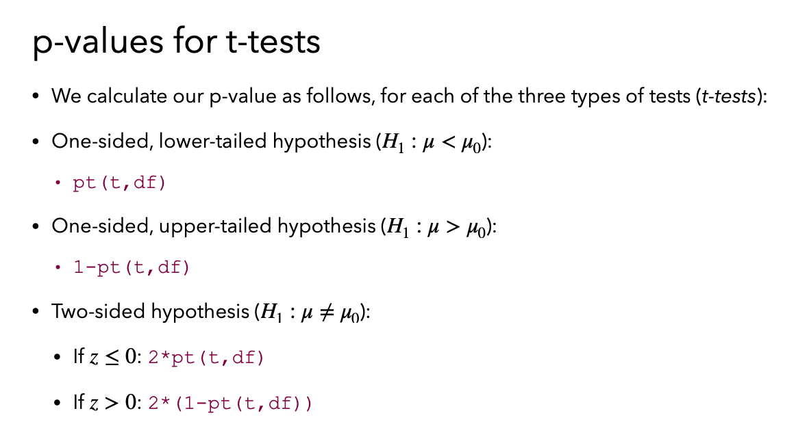

```{r setup, include=FALSE}
knitr::opts_chunk$set(echo = F, eval=T, tidy=TRUE, tidy.opts=list(width.cutoff=70))
library(tidyverse)
```


Q1: For sampling distribution, it can have sampling size $n$ and sampling time $m$, what determines if it follows CLT? $n$ or $m$? If we sample for 1 time and 100 times, each time with same size $n$, does that makes a difference? Another way to ask this question: if we sample for 20 times ($m = 20$), but each time with sample size $n = 100$, does that follow CLT?

# CLT and Sampling Distribution


# Margin of Error and Sample Size

Estimated sample size needed when confidence interval (CI) is given:

$$n=\left\lceil\frac{z_{\alpha / 2}^2 \cdot \sigma^2}{m^2}\right\rceil$$

# Normal Distribution Curve with ggplot 正态分布曲线

```{r, echo=FALSE, fig.width=5, fig.height=3, fig.align='center'}
f <- function(x, mu, sigma) {
return(1/(sqrt(2 *pi) * sigma) * exp(-0.5 * ((x - mu)/sigma)^2))
}

base <- ggplot() + xlim(-10, 10)
base + 
      geom_function(aes(colour = "mu = 0, sigma = 3"), fun = f, args = list(mu = 0, sigma = 3), size = 1, linetype = "longdash")
```

# T distribution T分布

When $\sigma^2$ is also unknown, we substitute the sample variance $s^2$ and use the t distribution instead of the normal distribution.

$$
t=\frac{\bar{x}-\mu_{0}}{{s}/{\sqrt{n}}}
$$

t distribution curve with ggplot, T分布曲线

```{r, echo=FALSE, fig.width=5, fig.height=3, fig.align='center'}
base <- ggplot() + xlim(-5, 5)
base + 
      geom_function(aes(colour = "df = 5"), fun = dt, args = list(df=5)) +
      geom_function(aes(colour = "df = 20"), fun = dt, args = list(df=20)) +
      geom_function(aes(colour = "df = 500"), fun = dt, args = list(df=500)) 
```

This t-statistic has a t distribution with n − 1 degrees of freedom

{width="500"}
