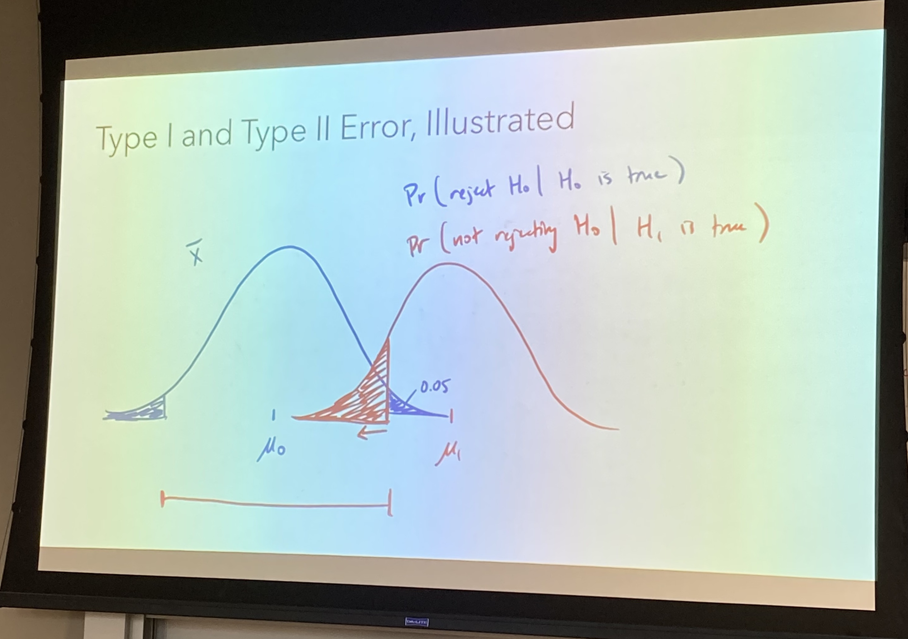

```{r setup, include=FALSE}
knitr::opts_chunk$set(echo = F, eval=T, tidy=TRUE, tidy.opts=list(width.cutoff=70))
library(tidyverse)
```

# Hypothesis Testing 假设检验

## Definition and Concepts 定义与概念

1.  null hypothesis, $H_{0}$: "no change"
2.  We believe the null hypothesis to be true unless overwhelming evidence exists to the contrary ("innocent until proven guilty")
3.  The alternative hypothesis, $H_{1}$, or $H_{A}$ (in this class, we all use $H_{1}$), is a second statement that contradicts $H_{0}$.
4.  Either $H_{0}$ or $H_{1}$ must be true (mutually exclusive, exhaustive).
5.  We need overwhelming evidence to conclude that $H_{1}$ is true. - That is why the alpha value, or the "threshold", should be very low, so the chance that $H_{0}$ is true is very low.

## Calculation 计算

1.  We calculate the probability of $H_{0}$ is true, which is the probability that you get a mean value from samples that is as extreme or more extreme than $\bar{X}$ if you assume that $H_{0}$ is true.
2.  For now, we assume the population show normal distribution.
3.  z-test: $$
    Z=\frac{\bar{X}-\mu}{\sigma / \sqrt{n}}
    $$
4.  calculating the p-values for z-tests:


Notes for two sided hypothesis:

when z \< 0, you get probability (pnorm(z)) like this:

```{r, echo=FALSE, fig.width=3, fig.height=2, fig.align='center'}
# Return dnorm(x) for 0 < x < 2, and NA for all other x
dnorm_limit <- function(x) {
    y <- dnorm(x)
    y[x > -1.5] <- NA
    return(y)
}

# ggplot() with dummy data
p <- ggplot(data.frame(x = c(-3, 3)), aes(x = x))

p +
  stat_function(fun = dnorm_limit, geom = "area", fill = "blue", alpha = 0.2) +
  stat_function(fun = dnorm)
```

when z \> 0, you get probability (1 - pnorm(z))like this:

```{r, echo=FALSE, fig.width=3, fig.height=2, fig.align='center'}
dnorm_limit <- function(x) {
y <- dnorm(x)
y[x < 1.5] <- NA
return(y)
}

# ggplot() with dummy data
p <- ggplot(data.frame(x = c(-3, 3)), aes(x = x))

p +
stat_function(fun = dnorm_limit, geom = "area", fill = "blue", alpha = 0.2) +
stat_function(fun = dnorm)
```

# Hypothesis Testing and Confidence Interval 假设检验与置信区间

## Mathematically equivalent.

# Type I and Type II errors 一类错误与二类错误

## Definition

|                | $\mu = \mu_{0}$   | $\mu \neq \mu_{0}$ |
|----------------|-------------------|--------------------|
| Fail to reject | Correct           | Incorrect(Type II) |
| Reject         | Incorrect(Type I) | Correct            |

### Type I error 一类错误

-   **Type I error occurs** if we reject a true null hypothesis ("false positive")

    -   $H_{0}: \mu = \mu_{0}$ is true, but we reject it.

-   The chance of Type I error is Pr(reject $H_{0}$\|$H_{0}$ is true)

-   The significance level $\alpha$ is the probability of making a type I error. Thus we decide what $\alpha$ is for our best

### Type II error 二类错误

-   **Type II error occurs** if we fail to reject a false null hypothesis ("false negative")

    -   $H_{0}: \mu = \mu_{0}$ is false, but we fail to reject it.

-   The probability of making a type II error is denoted $\beta$

-   The chance of Type II error is Pr(do not reject $H_{0}$\|$H_{0}$ is false)

## Illustrated

Dr.Kahng's illustrations shown as below:

{width="500"}

{width="500"}

{width="500"}

# Power

## Definition

-   The power of a test is equal to $1 - \beta$

## Calculation
