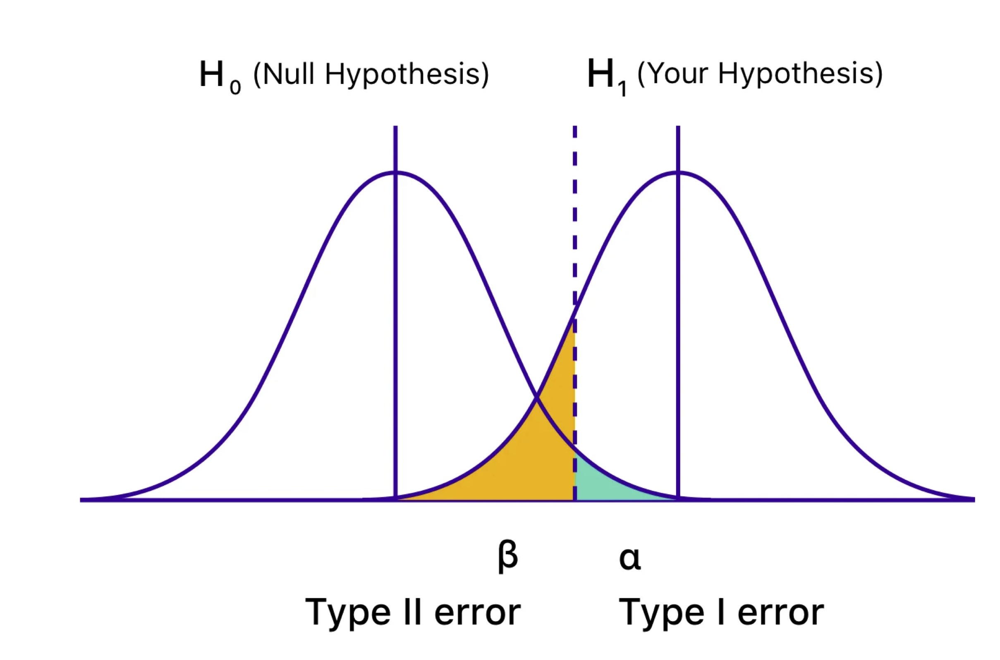

```{r setup, include=FALSE}
knitr::opts_chunk$set(echo = T, eval=T, tidy=TRUE, tidy.opts=list(width.cutoff=70))
library(tidyverse)
library(knitr)
```

# Type I and Type II Error, calculating power:

{width="500"}

# Skewness

Left (negative) skew: The left tail extends farther out than the right tail Right (positive skew): The right tail extends farther out than the left tail

# Quantiles

## Percentiles and quartiles

The p sample quantile is the value below which a proportion p of the data are located.

E.g., if your birth weight is at the 95th percentile, then you weighed more than 0.95 of all newborn babies.

IQR: Interquartile Range = Q3 - Q1

1st quartile (Q1): 25th percentile, 2nd quartile (Q2): 50th percentile (median), 3rd quartile (Q3): 75th percentile.

## Modified Boxplot

An outlier is a data point that is either:

-   Less than: Q1 − 1.5 × (Q3 − Q1) = lower fence of box
-   Greater than: Q3 + 1.5 × (Q3 − Q1) = upper fence of boxplot
-   Standard span: 1.5 × (Q3 − Q1) = 1.5 × IQR

# Variance

# Relationships Between Variables

Case CQ: Categorical and Quantitative

Case CC: Categorical and Categorical

Case QQ: Quantitative and Quantitative

# Three Variables

add color as the third dimension

# Empirical Rule

If a distribution is symmetric, unimodal, and bell-shaped (i.e., normally distributed), then the following hold:

-   Approximately 68% of observations fall within one SD of the mean: x ± s, or (x − s, x + s)

-   Approximately 95% of observations fall within two SDs of the mean: x ± 2s, or (x − 2s, x + 2s)

-   Approximately 99.7% of observations fall within three SDs of the mean: x ± 3s, or (x − 3s, x + 3s)

# Transformation:

## Box-Cox Power Transformation

$$
y_\lambda= \begin{cases}\frac{x^\lambda-1}{\lambda}, & \lambda \neq 0 \\ \log (x), & \lambda=0\end{cases}
$$
R code:

    ```{r, echo = T, eval = F}
    library(MASS)
    bc1 <- boxcox(x~1) 
    bc1$x[bc1$y==max(bc1$y)]
    ```

    ```{r, echo = T, eval = F}
    # Example code from assignment
    library(MASS)
    bc1 <- boxcox(df$price~1)
    lambda <- bc1$x[bc1$y==max(bc1$y)]
    trans <- (df$price ** lambda - 1) / lambda
    summary(trans)
    ```
    
    
## For right skewed data, use a function that tends to reduce larger values in proportion to smaller ones (i.e., an increasing function whose slope is decreasing):

### Log transformation:

in R: `log()`

### Square-root transformation:

in R: `sqrt`

# Check normality: qqplot

in R: `qqnorm(data); qqline(data)`