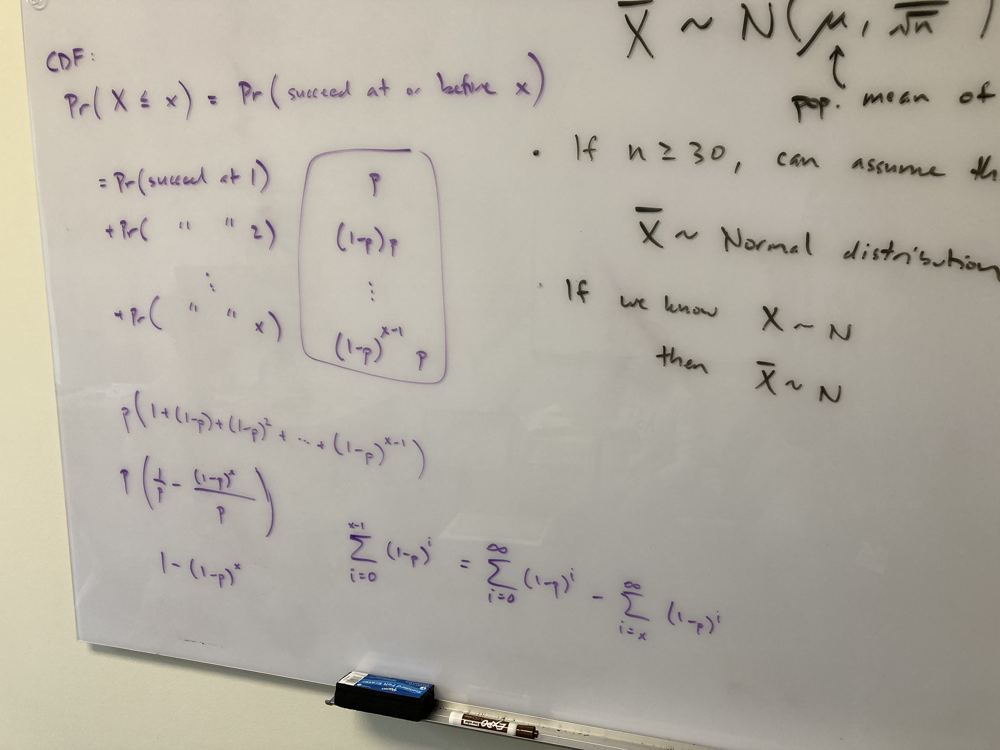
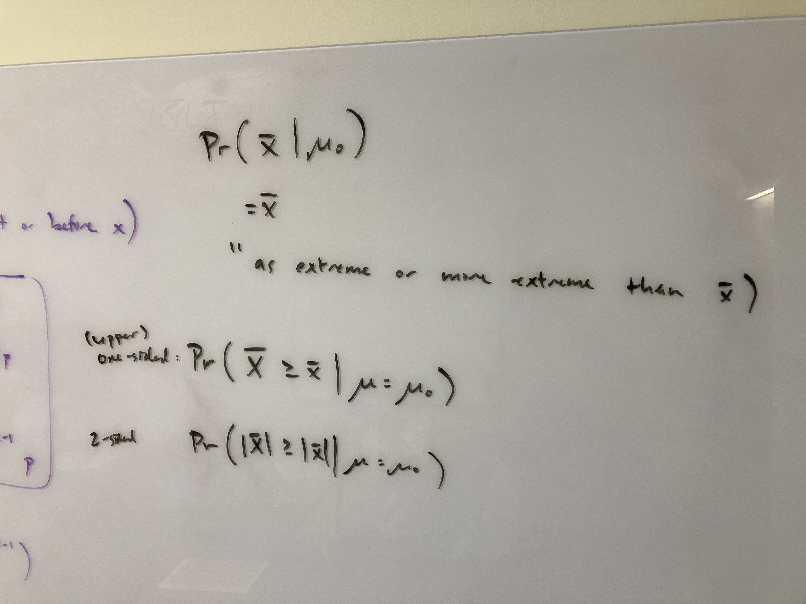
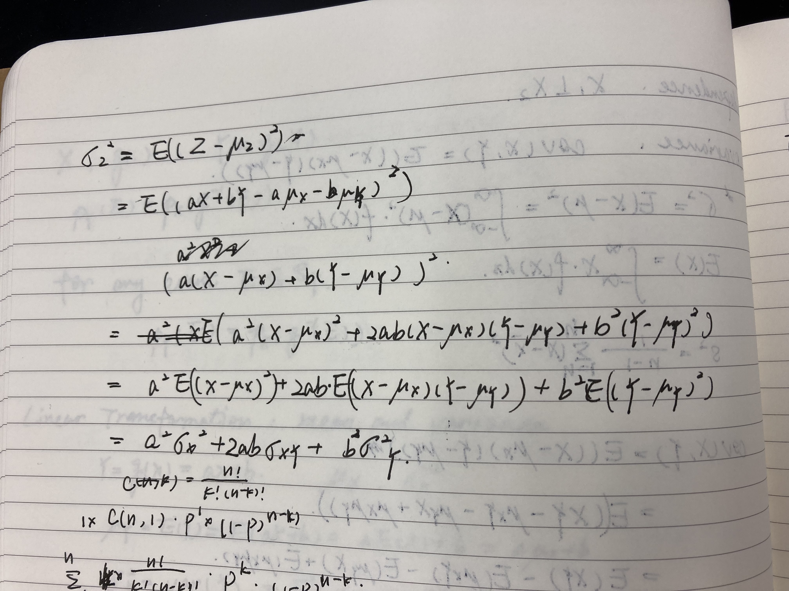

```{r setup, include=FALSE}
knitr::opts_chunk$set(echo = F, eval=T, tidy=TRUE, tidy.opts=list(width.cutoff=70))
```

\

Q1: Seems that we can treat data as normal distribution as long as the $n$ is large enough, then what are other distribution type for?

There are some ways to test if your samples follow a specific distribution, there are some functions/packages in R, you can just plug-in the data and run the test.

In the real world, determining distribution is really more "art" than "science". You need to combine your knowledge for specific cases and statistics.

\

Q2: Also, how do we determine the data distribution in the real world?

Answered in Q1.

\

Q3: **Why??** \textcolor{red}{CDF $P(X \le x) = 1 - (1-p)^{x}$ (1 minus the probability that the first $x$ trials all failed?)} - \textcolor{red}{A possible way to get it?}: probability that it takes more than $x$ time to get success: $P(X > x) = (1 - p)^{x}$, then CDF = $P(X \le x) = 1 - (1-p)^{x}$.

The understanding is correct.

See picture for another way to calculate that.

{width="500"}\

Q4: What is the definition of p-value? Not sure if I am understanding it correctly - If it is $Pr(X = \bar{x}|\mu = \mu_0)$, then it should be 0 if it follows normal distribution.

The correct definition should be "as extreme or more extreme than $\bar{x}$". See picture:

{width="500"}\

# 1. **General Knowledge**

## 1.1. Expectation - the population mean

**Expected value** of X, denoted $E(X)$, represents a theoretical average of an infinitely large sample

for discrete variable $E(X) = \sum_{x \in S_X} x \cdot Pr(X = x)$

for continuous variable $\int_{-\infty}^{\infty} Xf_X (X) \;dX$

## 1.2. Variance - measure the dispersion of values from the expectation(mean)

$var(X) = \sigma^2 = E((X - \mu)^2) = E(X^2) - E(X)^2$

for the case of continuous variable $\int_{-\infty}^{\infty} (X - \mu)^2f_X(X) \;dX$

## 1.3. Probability Distribution

For any $E \subseteq S_{X}$, we can define ${p}_{X}(E) = Pr(X \in E)$ , Then $\displaystyle \sum_{x \subseteq S_{X}} Pr(X = x) = 1$

## 1.4. Covariance

$cov(X, Y) = E(XY) - E(X)E(Y)$

how to get that (hint: $\mu_X = E(X)$ and $\mu_Y = E(Y)$, and they are considered as constant):

$cov(X, Y) = E((X - \mu_X)(Y - \mu_Y)) \\ = E((XY - Y\mu_X - X\mu_Y + \mu_X \cdot \mu_Y))\\ = E(XY) - \mu_X E(Y) - \mu_Y E(X) + E((\mu_X \mu_Y))\\ = E(XY) - E(X)E(Y) - E(X)E(Y) + E(X)E(Y)\\ = E(XY) - E(X)E(Y)$

## 1.5. Correlation

$corr(X, Y) = \frac{cov(X, Y)} {\sigma_{X}\sigma_{Y}} = \frac {E(XY) - E(X)E(Y)} {\sigma_{X}\sigma_{Y}}$

## 1.6. Linear transformation

Let $Z = aX + bY$

Then the mean of Z is $\mu_{Z} = a\mu_X + b\mu_Y = aE(X) + bE(Y)$

The variance of Z is $\sigma^2_{Z} = a^2\sigma^2_{X} + b^2\sigma^2_{Y} + 2ab\sigma_{XY}$

**Attention!!** \textcolor{red}{Should be $2ab\sigma_{XY}$ but not $2ab\sigma_{X}\sigma_{Y}$!!}

The standard deviation of Z is $\sigma_{Y} = \sqrt {a^2\sigma^2_{X} + b^2\sigma^2_{Y} + 2ab\sigma_{XY}}$

How do you get it:

{width="500"}

## 1.7. General transformation

1.  If $Y = g(X)$, $f(X) = p_X$ then $E(Y) = E(g(X)) = \int {g(X)}\cdot{f(X)} \;dX$
2.  if $Y = g(X)$, we **don't** necessarily get $E(g(X)) = g(E(X))$

# 2. **Theoretical Distributions**

Theoretical probability distributions describe what we expect to happen based on populations on a theoretical level

## 2.1. The following theoretical distributions will be considered in this class (D = discrete, C = continuous):

-   Bernoulli distribution (D)
-   Binomial distribution (D)
-   Poisson distribution (D)
-   Geometric distribution (D)
-   Uniform distribution (C)
-   Exponential distribution (C)
-   Normal distribution (C)

## 2.2. Bernoulli Distribution 伯努利分布

1.  Let $Y$ be a dichotomous random variable (takes one of two mutually exclusive values)

2.  Successes (= 1) occur with probability $p$ and failures (= 0) occur with probability $1-p$, for constant $p \in [0,1]$

3.  Notation: $Y \sim Bern(p)$

4.  Let Y be a dichotomous random variable representing a coin flip

    -   $Y = 1$: heads, success
    -   $Y = 0$: tails, fail
    -   If the coin has a 60% chance to get the head/success
    -   $E(Y) = 1\cdot p + 0\cdot(1-p) = p$
    -   $E(Y^2) = 1^2\cdot(p) + 0^2\cdot(1-p) = p$
    -   $var(Y) = \sigma^2_{Y} = E(Y^2) - E(Y)^2 = p - p^2 = p(1-p)$

## 2.3. Binomial Distribution 二项分布

1.  Definition: If we have a sequence of $n$ Bernoulli variables, each with a probability of success $p$, then the total number of successes is a binomial random variable.
    -   Assumptions: fixed number of trials, independent, constant p
2.  Notation: $X \sim Bin(n,p)$
3.  Note for *Combination* and *Permutation*
    1.  Combination: $C(n,k)$ or $\mathrm(^n_k)$
    2.  Permutation: $P(n,k)$
4.  Probability Mass Function:
    1.  $Pr(X = x) = \mathrm(^n_x) \cdot p^{x} \cdot (1-p)^{n-x}$
    2.  $Pr(X = x) = C(n,x) \cdot p^{x} \cdot (1-p)^{n-x}$
5.  Then if you flip coin for 100 times, $n = 100$, the probability to get head for k times is $Pr(X = x) = C(100, k) \cdot p^{k} (1-p)^{100-k}$
6.  How do you calculate it in ***R***?
    1.  Calculate the probability of x successes $Pr(X = x)$ using \textcolor{red}{dbinom(x, n, p)}
    2.  Calculate $Pr(X \le x)$ using \textcolor{red}{pbinom(x, n, p)}
    3.  Calculate $Pr(X \ge x)$ using \textcolor{red}{1 - pbinom(x - 1, n, p)}
7.  Summary measures
    1.  Expection $E(X) = np$
    2.  Variance $var(X) = \sigma^2_X = np(1-p)$
    3.  Stdev $\sigma_X = \sqrt {np(1-p)}$
8.  How do you get those above:
    1.  Consider Binomial Distribution as the sum of n times of Bernoulli Experiments
    2.  When $X \sim Bern(p)$
        1.  $E(X) = p$
        2.  $\sigma^2_X = p(1-p)$
    3.  Then let $Y \sim Bin(n,p)$
        1.  $E(Y) = np$
        2.  $\sigma^2_Y = n\sigma^2_X = np(1-p)$
9.  Main take-away points from the binomial distribution:
    1.  Fixed number of independent Bernoulli trials, n
    2.  Constant probability of success, p (Bernoulli parameter)
    3.  Interested in the total number of successes in n trials (not order)
    4.  Mean: $\mu_X = np$
    5.  Variance: $\sigma^2 = np(1 − p)$

## 2.4. Poisson Distribution 泊松分布

1.  Probability function is given by \textcolor{blue}{$P(X = x) = \frac {e^{-\lambda} {\lambda}^x} {x!}$}
2.  If $X \sim Pois(\lambda)$, then $\mu_{X} = \sigma^2_{x} = \lambda$
3.  Example problem in class slides
    -   setup: on average, 1.95 people develop the disease per year
    -   Q1: probability of no one developing the disease in the next year
        -   $\lambda = 1.95 = \mu_{X} = \sigma^2_{X}$
        -   $x = 0$
        -   $p = \frac {e^{-\lambda} {\lambda}^x} {x!} = (e^{-1.95} * (1.95)^0/0!) = e^{-1.95}$
        -   in *R*: exp(-1.95) = 0.1422741
    -   Q2: probability of one person developing the disease in the next year
        -   $x = 1$

        -   $p = \frac {e^{-\lambda} {\lambda}^x} {x!} = (e^{-1.95} \cdot (1.95)^1/1!) = e^{-1.95} \cdot (1.95)$

        -   in *R*: exp(-1.95) \* (1.95) = 0.2774344

{width="500"}

## 2.5. Geometric Distribution 几何分布

1.  Suppose $Y_1$, $Y_2$, ... is an infinite sequence of independent Bernoulli random variables with parameter $p$
2.  Let $X$ be the first index $i$ for which $Y_i = 1$ (location of first success)
3.  PMF: $P(X = x) = p(1 - p)^{x - 1}$
4.  plain English: what is the probability to take $x$ times to get the first success, given that the Bernoulli parameter is $p$, or the success rate is $p$.
5.  Notation: $X \sim Geom(p)$

{width="500"}

6.  if $p = 0.3$, draw PMF for $x \in [0, 40]$

```{r, fig.width=5, fig.height=4}
p = 0.3
f <- function(x) {
  return(p * (1 - p)^(x - 1))
}
curve(f, from = 0, to = 50)
```

7.  Mean $E(X) = \frac {1} {p}$
8.  Variance $\sigma^2 = \frac {1-p} {p^2}$
9.  **Why??** \textcolor{red}{CDF $P(X \le x) = 1 - (1-p)^{x}$ (1 minus the probability that the first $x$ trials all failed?)}
    -   A possible way to get it: probability that it takes more than $x$ time to get success: $P(X > x) = (1 - p)^{x}$, then CDF = $P(X \le x) = 1 - (1-p)^{x}$.

## 2.6. Uniform Distribution (Continuous)

1.  PDF: $$
    f_X(x)= \begin{cases}\frac{1}{b-a} ,& x \in[a, b] 
    \\ 0, & \text { otherwise }\end{cases}
    $$
2.  Why $f(x) = \frac {1} {b - a}$? Because only by that $\int^b_a f(x)dx = 1$
3.  Notation: $X \sim Unif(a,b)$
4.  $\mu = \frac {a+b} {2}$, $\sigma = \frac {(b-a)^2} {12}$

## 2.7. Exponential Distribution (Continuous)

1.  PDF: $f_X(x) = \lambda e^{-\lambda x}$, $\lambda > 0$
2.  Notation: $X \sim Exp(\lambda)$
3.  $\mu = 1/ \lambda$, $\sigma^2 = 1/ \lambda^2$
4.  CDF: $F_X(x) = 1 - e^{-\lambda x}$

## 2.8. Normal Distribution (Continuous)

1.  The most common continuous distribution is the normal distribution (also called a Gaussian distribution or bell-shaped curve)
    -   Shape of the binomial distribution when $p$ is constant but $n → \infty$

    -   Shape of the Poisson distribution when $\lambda → \infty$
2.  **PDF**: $f(x)=\frac{1}{\sqrt{2 \pi} \sigma} e^{-\frac{1}{2}\left(\frac{x-\mu}{\sigma}\right)^2}$
3.  Notation: $X \sim N(\mu, \sigma^2)$, note that in R, use stdev instead of variance
4.  Mean = median = mode = $\mu$, variance = $\sigma^2$, standard deviation = $\sigma$

```{r, fig.width=5, fig.height=4}
sigma <- 1
mu <- -5
f <- function(x) {
return(1 / (sqrt(2 * pi) * sigma) * exp(-0.5 * ((x - mu) / sigma)^2))
}
curve(f, from = -10, to = 0)
title(main = "PDF of normal distribution", sub = "sigma = 1, mu = -5")
```

5.  When $\mu = 0$ and $\sigma^2 =1$, we have the standard normal distribution.
6.  {width="500"}
7.  Z score of X when $X \sim N(\mu, \sigma)$
    -   definition of Z score: $z=\frac{x-\mu}{\sigma}$
    -   When X follows Normal distribution, always $Z \sim N(0, 1)$
    -   Usage example: when $\mu$ and $\sigma$ are known, how do we know the probability that $x \le a$
        -   $z = (a - \mu)/\sigma$, $Z \sim N(0, 1)$
        -   $P = pnorm((a - \mu)/\sigma)$
8.  {width="500"}
9.  Does empirical rule work well for Z score?
10. {width="500"}
11. {width="600"}

## 2.9. Central Limit Theorem(CLT) and Sampling Distribution

1.  **Sampling distribution**: If $X \sim N(\mu, \sigma)$, then $\bar{X} \sim N\left(\mu, \frac{\sigma}{\sqrt{n}}\right)$
2.  \textcolor{red}{Central Limit Theorem(CLT): If the population we are sampling from is not normal, then the shape of the distribution of $\overline{X}$ will be normal as long as $n$ is sufficiently large (typically $n \ge 30$ suffices).}
3.  Therefore, when $n$ is large enough, even X does not follow normal distribution, $\bar{X} \sim N\left(\mu, \frac{\sigma}{\sqrt{n}}\right)$
4.  Then the Z score of sampling mean is $Z=\frac{\bar{X}-\mu}{\frac{\sigma}{\sqrt{n}}}$, also, $Z \sim N(0, 1)$.

## 2.10 Sampling Distribution of a Proportion

1.  Suppose we are interested in the proportion of the time that an event occurs
2.  If we take a sample of size $n$ and observe $x$ successes, then we could estimate the population proportion p by $\hat{p} = x/n$.
3.  When $np \ge 5$ or $n(1-p) \ge 5$, it is considered that $\hat{p} \sim N\left(p, \sqrt{\frac{p(1-p)}{n}}\right)$.
4.  {width="600"}
