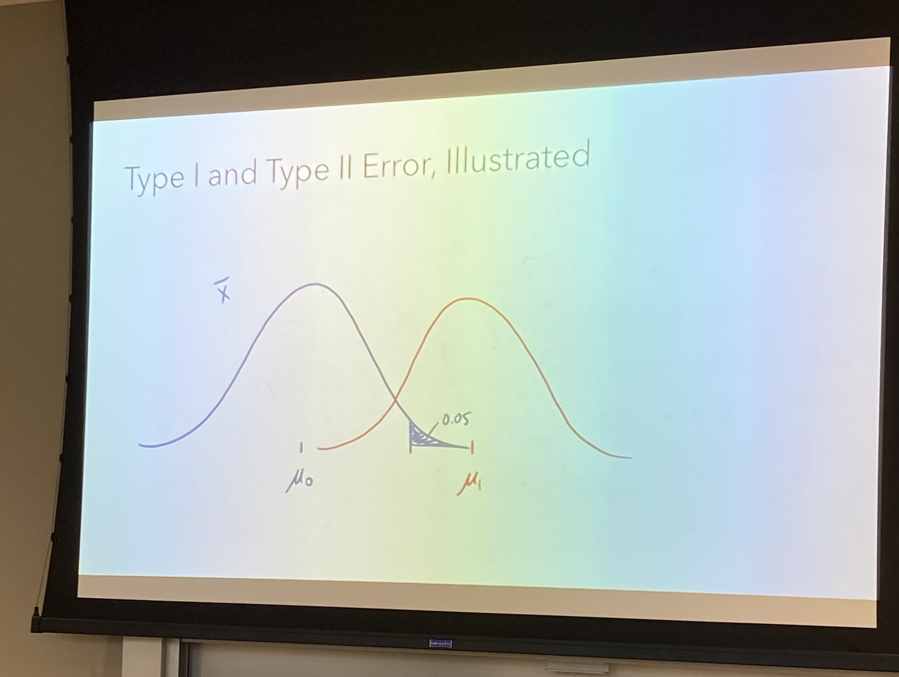
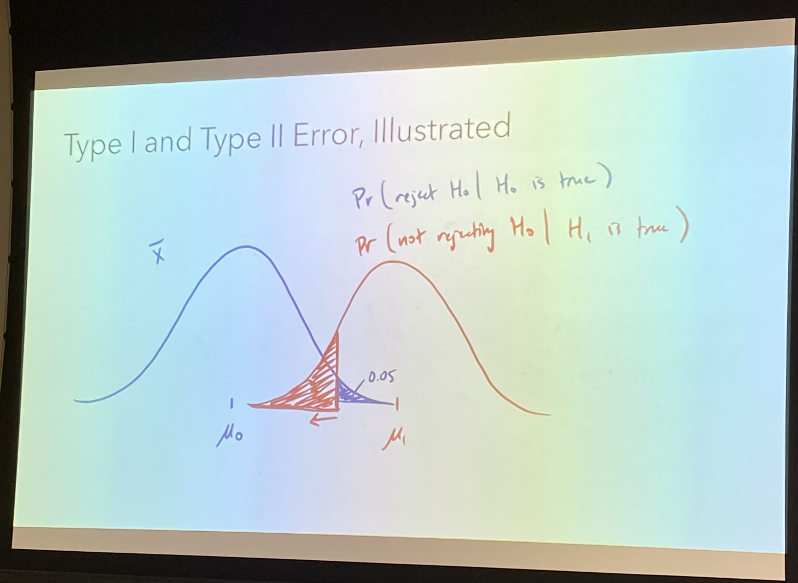
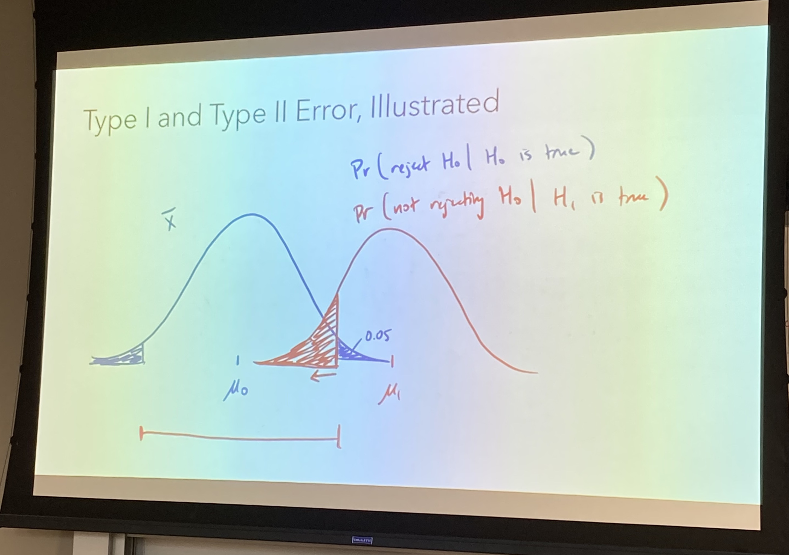

```{r setup, include=FALSE}
knitr::opts_chunk$set(echo = F, eval=T, tidy=TRUE, tidy.opts=list(width.cutoff=70))
library(tidyverse)
```

# Hypothesis Testing 假设检验

## Definition and Concepts 定义与概念

1.  null hypothesis, $H_{0}$: "no change"
2.  We believe the null hypothesis to be true unless overwhelming evidence exists to the contrary ("innocent until proven guilty")
3.  The alternative hypothesis, $H_{1}$, or $H_{A}$ (in this class, we all use $H_{1}$), is a second statement that contradicts $H_{0}$.
4.  Either $H_{0}$ or $H_{1}$ must be true (mutually exclusive, exhaustive).
5.  We need overwhelming evidence to conclude that $H_{1}$ is true. - That is why the alpha value, or the "threshold", should be very low, so the chance that $H_{0}$ is true is very low.

## Principle 原理

1.  Definition of p-value: We calculate the probability of $H_{0}$ is true, which is the probability that you get a mean value from samples that is as extreme or more extreme than $\bar{X}$ if you assume that $H_{0}$ is true.

2.  Significance: Given that $H_{0}$ is true, the probability of obtaining a sample statistic as or more extreme than the observed statistic is sufficiently small. In that case, we can reject $H_{0}$, and our data is more supportive of $H_{1}$. Such a test is statistically significant.

3.  If p-value is less than the pre-specified ***Significance level*** $\alpha$, then reject the null hypothesis

4.  For One-sided, lower-tailed hypothesis ($H_0: \mu \geq \mu_0$ and $H_1: \mu<\mu_0$):

    If the null hypothesis is that the true population mean is greater tham $\mu_0$, then the sampling mean can be close or less than $\mu_0$. Then the p-value should be Pr(x_bar \<= $\mu_0$)

    Calculates the probability that x is equal or smaller than $\mu_{0}$

    ```{r, echo=FALSE, fig.width=3, fig.height=2, fig.align='center'}
    # Return dnorm(x) for 0 < x < 2, and NA for all other x
    dnorm_limit <- function(x) {
        y <- dnorm(x)
        y[x > -0.5] <- NA
        return(y)
    }

    # ggplot() with dummy data
    p <- ggplot(data.frame(x = c(-3, 3)), aes(x = x))

    p +
      stat_function(fun = dnorm_limit, geom = "area", fill = "blue", alpha = 0.2) +
      stat_function(fun = dnorm) +
      geom_vline(xintercept = -0.5) +
      annotate("text", x = 0.1, y = 0.2, label = "x_bar") + 
      geom_vline(xintercept = 0, color = "red") +
      annotate("text", x = 0.5, y = 0.1, label = "mu_null", color = "red")
    ```

5.  For One-sided, upper-tailed hypothesis ($H_0: \mu \leq \mu_0$ and $H_1: \mu>\mu_0$):

    If the null hypothesis is that the true population mean is less tham $\mu_0$, then the sampling mean can be close or greater than $\mu_0$. Then the p-value should be Pr(x_bar \>= $\mu_0$)

    Calculates the probability that x is equal or smaller than $\mu_{0}$

    ```{r, echo=FALSE, fig.width=3, fig.height=2, fig.align='center'}
    # Return dnorm(x) for 0 < x < 2, and NA for all other x
    dnorm_limit <- function(x) {
        y <- dnorm(x)
        y[x < 0.5] <- NA
        return(y)
    }

    # ggplot() with dummy data
    p <- ggplot(data.frame(x = c(-3, 3)), aes(x = x))

    p +
      stat_function(fun = dnorm_limit, geom = "area", fill = "blue", alpha = 0.2) +
      stat_function(fun = dnorm) +
      geom_vline(xintercept = 0.5) +
      annotate("text", x = 1, y = 0.2, label = "x_bar") + 
      geom_vline(xintercept = 0, color = "red") +
      annotate("text", x = 0.5, y = 0.1, label = "mu_null", color = "red")
    ```

## Calculation of z-test and t-test 计算

1.  For now, we assume the population show normal distribution.

2.  z-test: $$
    z=\frac{\bar{x}-\mu_{0}}{\sigma / \sqrt{n}}
    $$

3.  Types of Hypotheses for z-test calculation:

    -   Lower-tailed (true mean is less than hypothesized mean)

        -   $H_0: \mu \geq \mu_0$ and $H_1: \mu<\mu_0$

        -   In R: `pnorm(z)`

    -   Upper-tailed (true mean is greater than hypothesized mean)

        -   $H_0: \mu \leq \mu_0$ and $H_1: \mu>\mu_0$

        -   In R: `1-pnorm(z)`

    -   Two-sided (true mean is not equal to the hypothesized mean)

        -   $H_0: \mu=\mu_0$ and $H_1: \mu \neq \mu_0$

        -   if $z \le 0$: `2*pnorm(z)`

        -   if $z > 0$: `2*(1-pnorm(z))`

4.  t-test: $$t=\frac{\bar{x}-\mu_0}{s / \sqrt{n}}$$

    -   with degree of freedom = $n - 1$

5.  Types of hypothesis for t-test calculation:

    -   Lower-tailed (true mean is less than hypothesized mean)

        -   $H_0: \mu \geq \mu_0$ and $H_1: \mu<\mu_0$

        -   In R: `pt(t, df)`

    -   Upper-tailed (true mean is greater than hypothesized mean)

        -   $H_0: \mu \leq \mu_0$ and $H_1: \mu>\mu_0$

        -   In R: `1-pt(t, df)`

    -   Two-sided (true mean is not equal to the hypothesized mean)

        -   $H_0: \mu=\mu_0$ and $H_1: \mu \neq \mu_0$

        -   if $z \le 0$: `2*pt(t, df)`

        -   if $z > 0$: `2*(1-pt(t, df))`

6.  Notes for two sided hypothesis:

    when z \< 0, you get probability (pnorm(z)) like this:

    ```{r, echo=FALSE, fig.width=3, fig.height=2, fig.align='center'}
    # Return dnorm(x) for 0 < x < 2, and NA for all other x
    dnorm_limit <- function(x) {
        y <- dnorm(x)
        y[x > -1.5] <- NA
        return(y)
    }

    # ggplot() with dummy data
    p <- ggplot(data.frame(x = c(-3, 3)), aes(x = x))

    p +
      stat_function(fun = dnorm_limit, geom = "area", fill = "blue", alpha = 0.2) +
      stat_function(fun = dnorm)
    ```

    when z \> 0, you get probability (1 - pnorm(z))like this:

    ```{r, echo=FALSE, fig.width=3, fig.height=2, fig.align='center'}
    dnorm_limit <- function(x) {
    y <- dnorm(x)
    y[x < 1.5] <- NA
    return(y)
    }

    # ggplot() with dummy data
    p <- ggplot(data.frame(x = c(-3, 3)), aes(x = x))

    p +
    stat_function(fun = dnorm_limit, geom = "area", fill = "blue", alpha = 0.2) +
    stat_function(fun = dnorm)
    ```

## Steps to perform hypothesis testing 解题步骤

1.  Check the conditions required for the validity of the test
2.  Define the parameter of interest in the context of the problem
3.  State the desired significance level
4.  State the null hypothesis
5.  State the alternative hypothesis
6.  Determine the proper test to use, and calculate the test statistic
7.  Calculate the p-value or critical value
8.  Make "reject/fail to reject" decision
9.  State your conclusion in the context of the problem

# Hypothesis Testing and Confidence Interval 假设检验与置信区间

## Mathematically equivalent.

# Type I and Type II errors 一类错误与二类错误

## Definition

|                | $\mu = \mu_{0}$   | $\mu \neq \mu_{0}$ |
|----------------|-------------------|--------------------|
| Fail to reject | Correct           | Incorrect(Type II) |
| Reject         | Incorrect(Type I) | Correct            |

### Type I error 一类错误

-   **Type I error occurs** if we reject a true null hypothesis ("false positive")

    -   $H_{0}: \mu = \mu_{0}$ is true, but we reject it.

-   The chance of Type I error is Pr(reject $H_{0}$\|$H_{0}$ is true)

-   The significance level $\alpha$ is the probability of making a type I error. Thus we decide what $\alpha$ is for our best

### Type II error 二类错误

-   **Type II error occurs** if we fail to reject a false null hypothesis ("false negative")

    -   $H_{0}: \mu = \mu_{0}$ is false, but we fail to reject it.

-   The probability of making a type II error is denoted $\beta$

-   The chance of Type II error is Pr(do not reject $H_{0}$\|$H_{0}$ is false)

## Illustrated

Dr.Kahng's illustrations shown as below:

{width="500"}

{width="500"}

{width="500"}

# Power

## Definition

-   The power of a test is equal to $1 - \beta$

## Calculation

## Power Curve

# Sample Size Estimation
